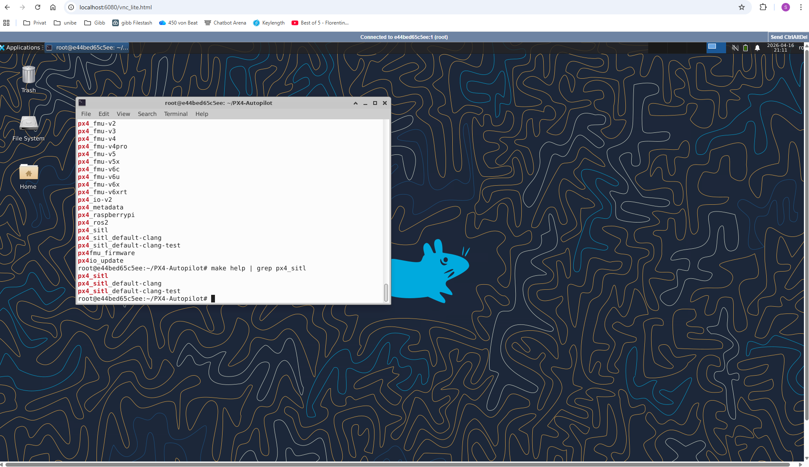
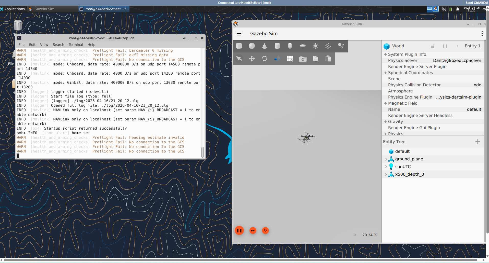
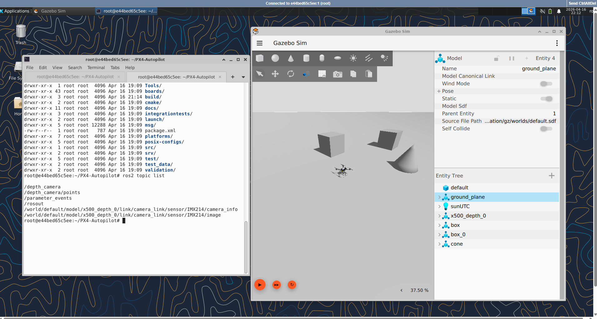
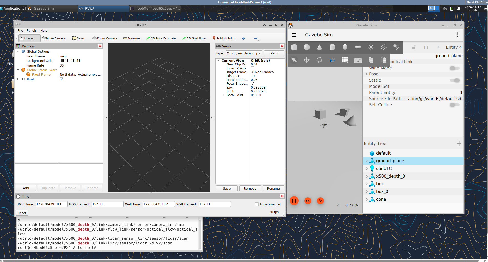
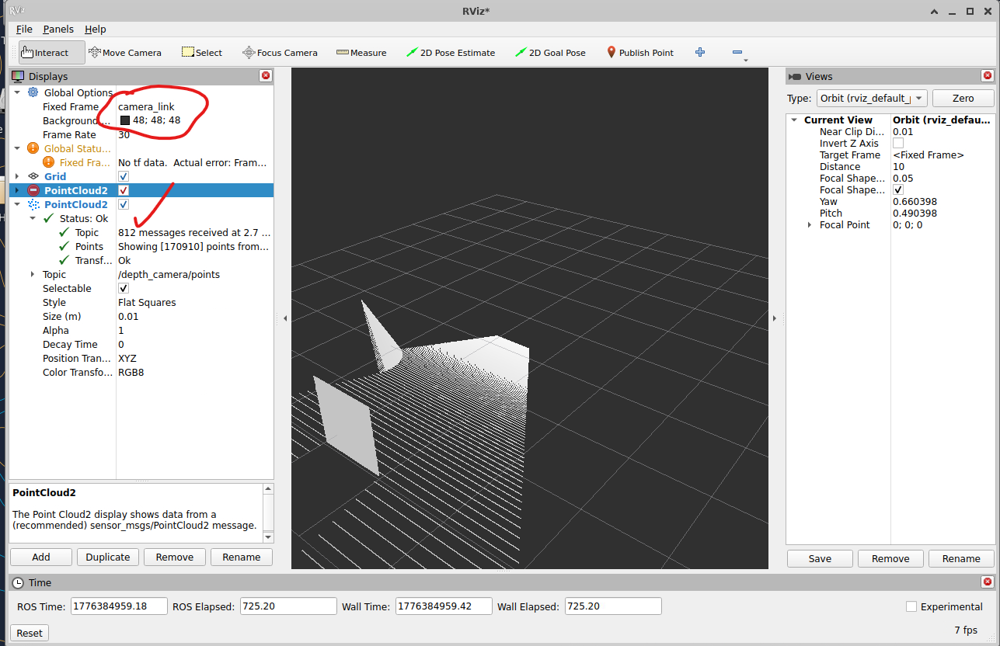

# Depth Estimation and 3D Point Cloud Generation
## Objective: 
Implement a ROS2 node that performs depth estimation from RGB-D or monocular camera inputs, generates 3D point clouds, and performs segmentation and analysis for downstream  perception tasks.

## Deliverables:
1. ROS2 node with stereo (or monocular) depth estimation, point cloud generation and filtering
nodes
2. Quantitative error analysis report with plots (optional)
3. Demo video of RViz2 visualization of estimated depth and segmented point cloud
4. Dockerfile or docker image with all dependencies (Optional)
5. GitHub repository with README.md --> **readme_exercise.md**

## Submission:
1. Create a comprehensive README.md in your GitHub repository that clearly explains your project.
It should include:
    - Step-by-step instructions for setting up and running the project
    - All deliverables, such as visualizations, embedded directly within the README
    - A link to your GitHub repository
    - The path or instructions to access the containerized Docker image of your work (either the Dockerfile in your repo or the Docker Hub link)


2. Ensure that your README is detailed enough for someone unfamiliar with your project to follow and reproduce your results.
3. Once complete, upload your GitHub repository via ILIAS for submission.

## Step-by-step instructions
### Building the image
Using WSL on Windows

Fork the repo, then execute the below, shown the consoe output with failure:

```bash
chrisk@iemob-nb50:~/workspace/px4-sim$ ./build.sh --base
[INFO] Building image (Ubuntu 24.04 LTS + ROS 2 Jazzy + Gazebo Harmonic)
[+] Building 652.1s (8/16)                                                                               docker:default
 => [internal] load build definition from ros2-jazzy-gazebo-harmonic.Dockerfile                                    0.0s
 => => transferring dockerfile: 2.58kB                                                                             0.0s
 => [internal] load metadata for docker.io/library/ubuntu:24.04                                                    1.0s
 => [auth] library/ubuntu:pull token for registry-1.docker.io                                                      0.0s
 => [internal] load .dockerignore                                                                                  0.0s
 => => transferring context: 2B                                                                                    0.0s
 => [internal] load build context                                                                                  0.0s
 => => transferring context: 38B                                                                                   0.0s
 => CACHED [ 1/11] FROM docker.io/library/ubuntu:24.04@sha256:c4a8d5503dfb2a3eb8ab5f807da5bc69a85730fb49b5cfca233  0.0s
 => => resolve docker.io/library/ubuntu:24.04@sha256:c4a8d5503dfb2a3eb8ab5f807da5bc69a85730fb49b5cfca2330194ebcc4  0.0s
 => [ 2/11] RUN apt-get update && apt-get install -y     locales     && locale-gen en_US en_US.UTF-8     && upd  322.8s
 => ERROR [ 3/11] RUN apt-get update && apt-get install -y     git     curl     lsb-release     gnupg2     soft  328.2s
------
 > [ 3/11] RUN apt-get update && apt-get install -y     git     curl     lsb-release     gnupg2     software-properties-common     && rm -rf /var/lib/apt/lists/*:
11.96 Get:1 http://security.ubuntu.com/ubuntu noble-security InRelease [126 kB]
18.48 Err:2 http://archive.ubuntu.com/ubuntu noble InRelease
18.48   400  Bad Request [IP: 91.189.92.24 80]
39.51 Get:3 http://archive.ubuntu.com/ubuntu noble-updates InRelease [126 kB]
41.58 Get:4 http://security.ubuntu.com/ubuntu noble-security/main amd64 Packages [2025 kB]
53.33 Get:5 http://archive.ubuntu.com/ubuntu noble-backports InRelease [126 kB]
57.18 Get:6 http://archive.ubuntu.com/ubuntu noble-updates/main amd64 Packages [2402 kB]
72.66 Get:7 http://security.ubuntu.com/ubuntu noble-security/restricted amd64 Packages [3581 kB]
83.10 Get:8 http://security.ubuntu.com/ubuntu noble-security/multiverse amd64 Packages [34.8 kB]
121.9 Get:9 http://archive.ubuntu.com/ubuntu noble-updates/multiverse amd64 Packages [38.5 kB]
148.8 Ign:10 http://security.ubuntu.com/ubuntu noble-security/universe amd64 Packages
154.1 Get:10 http://security.ubuntu.com/ubuntu noble-security/universe amd64 Packages [1507 kB]
158.8 Get:11 http://archive.ubuntu.com/ubuntu noble-updates/restricted amd64 Packages [3752 kB]
227.6 Get:12 http://archive.ubuntu.com/ubuntu noble-updates/universe amd64 Packages [2156 kB]
262.8 Get:13 http://archive.ubuntu.com/ubuntu noble-backports/universe amd64 Packages [36.1 kB]
288.9 Ign:14 http://archive.ubuntu.com/ubuntu noble-backports/multiverse amd64 Packages
305.8 Get:15 http://archive.ubuntu.com/ubuntu noble-backports/main amd64 Packages [49.5 kB]
327.9 Get:14 http://archive.ubuntu.com/ubuntu noble-backports/multiverse amd64 Packages [695 B]
327.9 Reading package lists...
328.2 E: Failed to fetch http://archive.ubuntu.com/ubuntu/dists/noble/InRelease  400  Bad Request [IP: 91.189.92.24 80]
328.2 E: The repository 'http://archive.ubuntu.com/ubuntu noble InRelease' is not signed.
------
ros2-jazzy-gazebo-harmonic.Dockerfile:22
--------------------
  21 |     # Install essential tools
  22 | >>> RUN apt-get update && apt-get install -y \
  23 | >>>     git \
  24 | >>>     curl \
  25 | >>>     lsb-release \
  26 | >>>     gnupg2 \
  27 | >>>     software-properties-common \
  28 | >>>     && rm -rf /var/lib/apt/lists/*
  29 |
--------------------
ERROR: failed to build: failed to solve: process "/bin/sh -c apt-get update && apt-get install -y     git     curl     lsb-release     gnupg2     software-properties-common     && rm -rf /var/lib/apt/lists/*" did not complete successfully: exit code: 100
chrisk@iemob-nb50:~/workspace/px4-sim$
```

The problem seems to be some Docker network layer issue. After updating in the docker-file all run commands by

```
RUN apt-get -o Acquire::ForceIPv4=true update && apt-get install -y
```

the script run through

```bash
chrisk@iemob-nb50:~/workspace/px4-sim$ ./build.sh --all
[INFO] Building image (Ubuntu 24.04 LTS + ROS 2 Jazzy + Gazebo Harmonic)
[+] Building 2.0s (17/17) FINISHED                                                                           docker:default
 => [internal] load build definition from ros2-jazzy-gazebo-harmonic.Dockerfile                                        0.0s
 => => transferring dockerfile: 2.58kB                                                                                 0.0s
 => [internal] load metadata for docker.io/library/ubuntu:24.04                                                        1.5s
 => [auth] library/ubuntu:pull token for registry-1.docker.io                                                          0.0s
 => [internal] load .dockerignore                                                                                      0.0s
 => => transferring context: 2B                                                                                        0.0s
 => [ 1/11] FROM docker.io/library/ubuntu:24.04@sha256:c4a8d5503dfb2a3eb8ab5f807da5bc69a85730fb49b5cfca2330194ebcc41c  0.0s
 => => resolve docker.io/library/ubuntu:24.04@sha256:c4a8d5503dfb2a3eb8ab5f807da5bc69a85730fb49b5cfca2330194ebcc41c7b  0.0s
 => [internal] load build context                                                                                      0.0s
 => => transferring context: 38B                                                                                       0.0s
 => CACHED [ 2/11] RUN apt-get update && apt-get install -y     locales     && locale-gen en_US en_US.UTF-8     && up  0.0s
 => CACHED [ 3/11] RUN apt-get update && apt-get install -y     git     curl     lsb-release     gnupg2     software-  0.0s
 => CACHED [ 4/11] RUN export ROS_APT_SOURCE_VERSION=$(curl -s https://api.github.com/repos/ros-infrastructure/ros-ap  0.0s
 => CACHED [ 5/11] RUN apt-get update && apt-get install -y     ros-jazzy-desktop     ros-dev-tools     python3-colco  0.0s
 => CACHED [ 6/11] RUN rosdep init && rosdep update                                                                    0.0s
 => CACHED [ 7/11] RUN curl https://packages.osrfoundation.org/gazebo.gpg --output /usr/share/keyrings/pkgs-osrf-arch  0.0s
 => CACHED [ 8/11] RUN apt-get update && apt-get install -y     gz-harmonic     ros-jazzy-ros-gz     && rm -rf /var/l  0.0s
 => CACHED [ 9/11] RUN echo 'source /opt/ros/$ROS_DISTRO/setup.bash' >> /root/.bashrc                                  0.0s
 => CACHED [10/11] WORKDIR /root                                                                                       0.0s
 => CACHED [11/11] COPY ./ros_entrypoint.sh /                                                                          0.0s
 => exporting to image                                                                                                 0.2s
 => => exporting layers                                                                                                0.0s
 => => exporting manifest sha256:b9a114fdccf157d6f934dd88a0214d7d55214fd8a54f8375a260677b7810480a                      0.0s
 => => exporting config sha256:fa9a7905449aba2178eae5f5f72b3e32905ea285170f1fe4ed66eddfba753f7c                        0.0s
 => => exporting attestation manifest sha256:ed604cfb1cf776abe8b05a2a7421a22b629da6dfdf5db6d3e3e92ea3f6fbaff5          0.0s
 => => exporting manifest list sha256:9709457808f79488365df836c79875feac11edd99fb525ae4406566359824c25                 0.0s
 => => naming to docker.io/erdemuysalx/ros2-jazzy-gazebo-harmonic:latest                                               0.0s
 => => unpacking to docker.io/erdemuysalx/ros2-jazzy-gazebo-harmonic:latest                                            0.0s
[INFO] Image built successfully!
[INFO] Building image (Ubuntu 24.04 LTS + ROS 2 Jazzy + Gazebo Harmonic + PX4 Autopilot + MAVROS + NoVNC)
WARNING: This output is designed for human readability. For machine-readable output, please use --format.
[+] Building 826.9s (19/19) FINISHED                                                                         docker:default
 => [internal] load build definition from px4-sitl.Dockerfile                                                          0.0s
 => => transferring dockerfile: 4.96kB                                                                                 0.0s
 => [internal] load metadata for docker.io/erdemuysalx/ros2-jazzy-gazebo-harmonic:latest                               0.1s
 => [internal] load .dockerignore                                                                                      0.0s
 => => transferring context: 2B                                                                                        0.0s
 => [ 1/14] FROM docker.io/erdemuysalx/ros2-jazzy-gazebo-harmonic:latest@sha256:9709457808f79488365df836c79875feac11e  0.1s
 => => resolve docker.io/erdemuysalx/ros2-jazzy-gazebo-harmonic:latest@sha256:9709457808f79488365df836c79875feac11edd  0.0s
 => [internal] load build context                                                                                      0.0s
 => => transferring context: 2.79kB                                                                                    0.0s
 => [ 2/14] RUN apt-get -o Acquire::ForceIPv4=true update && apt-get install -y     build-essential     cmake     ni  51.2s
 => [ 3/14] RUN pip3 install --no-cache-dir --break-system-packages     kconfiglib     jsonschema     pyros-genmsg     6.1s
 => [ 4/14] WORKDIR /root                                                                                              0.1s
 => [ 5/14] RUN git clone https://github.com/PX4/PX4-Autopilot.git --recursive     && cd PX4-Autopilot               314.2s
 => [ 6/14] RUN apt-get -o Acquire::ForceIPv4=true update && apt-get install -y     ros-jazzy-mavros                  32.0s
 => [ 7/14] RUN wget https://raw.githubusercontent.com/mavlink/mavros/ros2/mavros/scripts/install_geographiclib_data  32.6s
 => [ 8/14] RUN apt-get -o Acquire::ForceIPv4=true update && apt-get install -y     xfce4     xfce4-goodies     dbu  146.7s
 => [ 9/14] RUN mkdir -p /root/.vnc     && echo "1234" | vncpasswd -f > /root/.vnc/passwd     && chmod 600 /root/.vnc  0.5s
 => [10/14] RUN echo '#!/bin/sh\nunset SESSION_MANAGER\nunset DBUS_SESSION_BUS_ADDRESS\nexec startxfce4' > /root/.vnc  0.4s
 => [11/14] RUN mkdir -p /var/log/supervisor                                                                           0.3s
 => [12/14] RUN echo '[supervisord]\nnodaemon=true\nuser=root\n\n[program:vncserver]\ncommand=/usr/bin/vncserver :1 -  0.3s
 => [13/14] RUN echo 'source /opt/ros/jazzy/setup.bash' >> /root/.bashrc     && echo 'export GZ_SIM_RESOURCE_PATH=/ro  0.3s
 => [14/14] COPY ./px4_entrypoint.sh /                                                                                 0.0s
 => exporting to image                                                                                               241.6s
 => => exporting layers                                                                                              151.7s
 => => exporting manifest sha256:29269bf03a497048251e873883fa91d2e52d813d969de883733a0d27a57585d7                      0.0s
 => => exporting config sha256:325aaae8b6a8df99c7dca346c90512021ece62ea44de7c5159424eb2c715f2f3                        0.0s
 => => exporting attestation manifest sha256:34f4004ca3a3cae89405139fd751cd17cac37b1a9babce208ee973ecf1a1e96d          0.0s
 => => exporting manifest list sha256:7e0d9a813c48f9a3d8ee2c8a77f374d99004eabef09ebe9b57363372c6c2ab33                 0.0s
 => => naming to docker.io/erdemuysalx/px4-sitl:latest                                                                 0.0s
 => => unpacking to docker.io/erdemuysalx/px4-sitl:latest                                                             89.6s
[INFO] Image built successfully!
chrisk@iemob-nb50:~/workspace/px4-sim$
```

### Run the container

Check the images first, expected are
- erdemuysalx/px4-sitl:latest
- erdemuysalx/ros2-jazzy-gazebo-harmonic:latest 

```bash
chrisk@iemob-nb50:~/workspace/px4-sim$ docker images
                                                                                                        i Info →   U  In Use
IMAGE                                                                       ID             DISK USAGE   CONTENT SIZE   EXTRA
adminer:latest                                                              16a72c6140f6        170MB         46.5MB
docker/desktop-kubernetes:kubernetes-v1.34.1-cni-v1.7.1-critools-v1.33.0-cri-dockerd-v0.3.20-1-debian
                                                                            12d6673564e0        592MB          185MB
docker/desktop-storage-provisioner:v3.0                                     57d2b6ad1c6f       80.3MB         23.9MB    U
docker/desktop-vpnkit-controller:v4.0                                       bdaff3408b1c       52.6MB         11.9MB    U
environment-uploader:latest                                                 9c59c8191337        1.5GB          387MB    U
erdemuysalx/px4-sitl:latest                                                 7e0d9a813c48       14.2GB         4.31GB
erdemuysalx/ros2-jazzy-gazebo-harmonic:latest                               9709457808f7       7.16GB         1.61GB
hello-world:latest...
chrisk@iemob-nb50:~/workspace/px4-sim$
```

Now run the container
```bash
docker compose up
```

Open in the browser ```http://localhost:6080/vnc_lite.html``` 

Asking for a Password, enter **1234** 

then the Desktop is show. Open a terminal and listing the make target for *px4_sitl*




**Note** the following only showed a black screen with blinking white carrets
- http://localhost:6080/vnc.html
- http://localhost:6080/vnc_auto.html

I don't know why.

**Note** One can connect to a bash in the container. For that, just open a new WSL Ubuntu terminal (one is taken by running the container) and enter
```bash
chrisk@iemob-nb50:~/workspace/px4-sim$ docker exec -it px4_sitl bash
root@e44bed65c5ee:~# ps -ef
UID          PID    PPID  C STIME TTY          TIME CMD
root           1       0  0 20:23 pts/0    00:00:00 /bin/bash
...
```

This can be usefull for debugging. 

### Start px4 sitl
Open terminal inside the browser desktop, and do
```bash
make px4_sitl gz_x500_depth
```

this starts *Gazebo Sim*



Adding some obstacles and the *ros2 topic list*



### Start simulation 
Start the simulation in Gazebo Sim. Running

```bash
ros2 topic echo /depth_camera/points
```

streams like

```bash
 count: 1
- name: z
  offset: 8
  datatype: 7
  count: 1
- name: rgb
  offset: 16
  datatype: 7
  count: 1
is_bigendian: false
point_step: 24
row_step: 15360
data:
- 0
- 0
- 128
- 127
- 0
- 0
- 128
- 127
- 0
- 0
...
```

### Implement a ROS2 node that subscribes to RGB and depth image topics and publishes filtered point cloud (obstacles only) for downstream use

What we have so far is a depth camera:
- RGB camera
- Depth computation pipeline
- Point cloud output already available

Do the following steps inside the container:

```bash
mkdir -p /root/ros2_ws/src
cd /root/ros2_ws/src

ros2 pkg create depth_perception \
  --build-type ament_python \
  --dependencies rclpy sensor_msgs std_msgs

cd /root/ros2_ws
colcon build

source install/setup.bash
```
**Check**
```bash
root@e44bed65c5ee:~/ros2_ws# printenv | grep ROS
ROS_VERSION=2
ROS_PYTHON_VERSION=3
ROS_AUTOMATIC_DISCOVERY_RANGE=SUBNET
ROS_DISTRO=jazzy
root@e44bed65c5ee:~/ros2_ws# ros2 topic list
/depth_camera
/depth_camera/pointsn
/parameter_events
/rosout
/world/default/model/x500_depth_0/link/camera_link/sensor/IMX214/camera_info
/world/default/model/x500_depth_0/link/camera_link/sensor/IMX214/image
root@e44bed65c5ee:~/ros2_ws#
```

this seems all fine so far. :-)


### Create node file

Create: /root/ros2_ws/src/depth_perception/depth_perception/pointcloud_filter.py

with content:
```python
import rclpy
from rclpy.node import Node

from sensor_msgs.msg import PointCloud2
from sensor_msgs_py import point_cloud2

import numpy as np
#import open3d as o3d


class PointCloudFilter(Node):

    def __init__(self):
        super().__init__('pointcloud_filter')

        self.sub = self.create_subscription(
            PointCloud2,
            '/depth_camera/points',
            self.callback,
            10
        )

        self.pub = self.create_publisher(
            PointCloud2,
            '/obstacle_points',
            10
        )

        self.get_logger().info("PointCloud Filter Node started")

    def callback(self, msg):

        # Convert ROS → numpy
        points = np.array(list(point_cloud2.read_points(
            msg,
            field_names=("x", "y", "z"),
            skip_nans=True
        )))

        if points.shape[0] < 50:
            return

        # Open3D cloud
        #cloud = o3d.geometry.PointCloud()
        #cloud.points = o3d.utility.Vector3dVector(points)

        # Downsample (important for performance)
        #cloud = cloud.voxel_down_sample(voxel_size=0.1)

        # RANSAC ground removal
        #try:
        #    plane_model, inliers = cloud.segment_plane(
        #        distance_threshold=0.2,
        #        ransac_n=3,
        #        num_iterations=100
        #    )

        #    obstacles = cloud.select_by_index(inliers, invert=True)

        #except Exception as e:
        #    self.get_logger().warn(f"RANSAC failed: {e}")
        #    return

        obs_points = np.asarray(obstacles.points)

        # Convert back to ROS2 PointCloud2
        out_msg = point_cloud2.create_cloud_xyz32(msg.header, obs_points)

        self.pub.publish(out_msg)


def main(args=None):
    rclpy.init(args=args)
    node = PointCloudFilter()
    rclpy.spin(node)
    node.destroy_node()
    rclpy.shutdown()


if __name__ == '__main__':
    main()
```

**Note** I had unsolvable Problem installing open3d, so this is outcommented in the file above. 

### further steps

in the file: /root/ros2_ws/src/depth_perception/setup.py

make sure:

```python
entry_points={
    'console_scripts': [
        'pointcloud_filter = depth_perception.pointcloud_filter:main',
    ],
},
```

### run the node

```bash
root@e44bed65c5ee:~/ros2_ws# ros2 run depth_perception pointcloud_filter
[INFO] [1776382067.905639673] [pointcloud_filter]: PointCloud Filter Node started
```

### Streaming camera points

Having RGB points:

```bash
root@e44bed65c5ee:~/ros2_ws# ros2 topic echo /depth_camera/points --once
header:
  stamp:
    sec: 245
    nanosec: 60000000
  frame_id: camera_link
height: 480
width: 640
fields:
- name: x
  offset: 0
  datatype: 7
  count: 1
- name: y
  offset: 4
  datatype: 7
  count: 1
- name: z
  offset: 8
  datatype: 7
  count: 1
- name: rgb
  offset: 16
  datatype: 7
  count: 1
is_bigendian: false
point_step: 24
row_step: 15360
data:
- 0
- 0
- 128
- 127
- 0
- 0
- 128
- 127
- 0
- 0
- 128
- 127
- 0
- 0
- 0
- 0
- 0
- 0
- 0
- 0
- 0
- 0
- 0
- 0
- 0
- 0
- 128
- 127
- 0
- 0
- 128
- 127
- 0
- 0
- 128
- 127
- 0
- 0
- 0
- 0
- 0
- 0
- 0
- 0
- 0
- 0
- 0
- 0
- 0
- 0
- 128
- 127
- 0
- 0
- 128
- 127
- 0
- 0
- 128
- 127
- 0
- 0
- 0
- 0
- 0
- 0
- 0
- 0
- 0
- 0
- 0
- 0
- 0
- 0
- 128
- 127
- 0
- 0
- 128
- 127
- 0
- 0
- 128
- 127
- 0
- 0
- 0
- 0
- 0
- 0
- 0
- 0
- 0
- 0
- 0
- 0
- 0
- 0
- 128
- 127
- 0
- 0
- 128
- 127
- 0
- 0
- 128
- 127
- 0
- 0
- 0
- 0
- 0
- 0
- 0
- 0
- 0
- 0
- 0
- 0
- 0
- 0
- 128
- 127
- 0
- 0
- 128
- 127
- '...'
is_dense: true
---
root@e44bed65c5ee:~/ros2_ws#
```

### RViz

Starting

```bash
root@e44bed65c5ee:~/ros2_ws# rviz2
QStandardPaths: XDG_RUNTIME_DIR not set, defaulting to '/tmp/runtime-root'
[INFO] [1776384232.908557873] [rviz2]: Stereo is NOT SUPPORTED
[INFO] [1776384232.909177279] [rviz2]: OpenGl version: 4.5 (GLSL 4.5)
[INFO] [1776384233.217657902] [rviz2]: Stereo is NOT SUPPORTED
```





